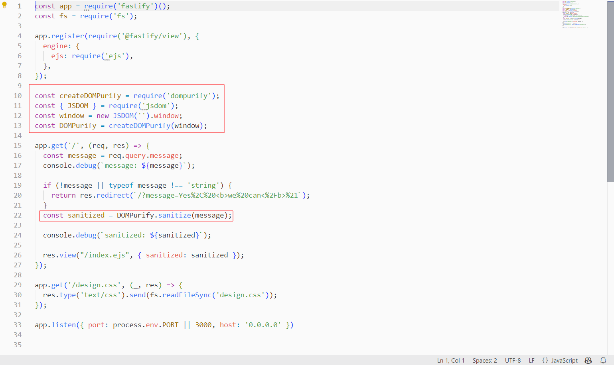
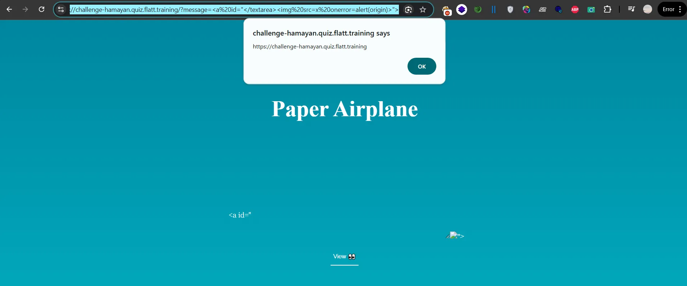

Hey, in the last few days i came a cross this client side challenge in twitter (Flatt jp xss) and i wanted to share the solution with you 




we have a pretty straightforward  challenge as you see above 

```jsx
const createDOMPurify = require('dompurify');
const { JSDOM } = require('jsdom');
const window = new JSDOM('').window;
const DOMPurify = createDOMPurify(window);

app.get('/', (req, res) => {
  const message = req.query.message;
  //...
  const sanitized = DOMPurify.sanitize(message);
  res.view("/index.ejs", { sanitized: sanitized });
});
```

Basically this code sets up an Express.js server that uses DOMPurify to sanitize user input. It begins by importing the necessary modules, dompurify and jsdom, and creates a new JSDOM window to initialize DOMPurify. When a GET request is made to the root path '/', the server retrieves the message from the query parameters, sanitizes it using DOMPurify.sanitize(message) to remove any potentially harmful code, and then renders the index.ejs view, passing the sanitized message to ensure that only safe content is displayed to the user.

so server-side implementation uses DOMPurify, and since the version used is current, bypassing it doesn't seem to be the intended 

so let's move to where the sanitzed input is rendred 

```js
<h1>Paper Airplane</h1>
    <p class="message"><%- sanitized %></b></p>
    <form method="get" action="">
        <textarea name="message"><%- sanitized %></textarea>
        <p>
            <input type="submit" value="View 👀" formaction="/" />
        </p>
    </form>
```

The issue lies in the improper handling of user input in a `<textarea>` tag where DOMPurify's sanitization doesn't prevent misuse due to how the browser interprets HTML(Dom parsing). DOMPurify effectively removes sus content in most scenarios but doesn't consider specific contextual flaws when sanitized output is embedded in a `<textarea>` tag.

The `<textarea>` element renders user input as plain text. However, if an we prematurely closes the `<textarea>` with `<textarea>`, the subsequent content is interpreted as standard HTML.While DOMPurify ensures input is stripped of sus tags and attributes, it assumes a static context. It does not address scenarios where the browser reinterprets sanitized content outside its original tag so user input is rendered in both a `<p>` tag and a `<textarea>` tag. In the `<textarea>`, sanitized input is interpreted as HTML syntax. By leveraging this behavior, we can inject HTML elements that execute JavaScript or manipulate the DOM.

```js
<a id="</textarea>">
```


