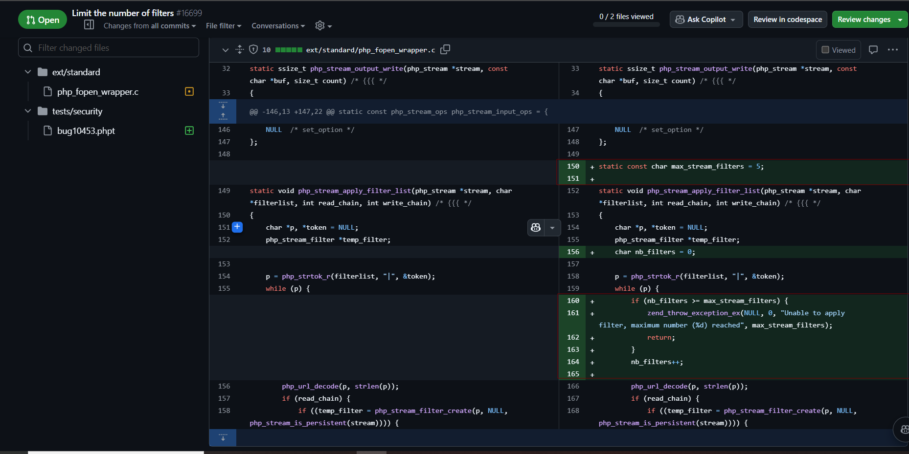

# The End of PHP Filter Chains: A Security Evolution

## Introduction

PHP filter chains have long been a powerful tool for attackers, offering various exploitation techniques from file reading to memory exhaustion. However, a recent pull request (#16699) in the PHP source code marks a significant turning point in this era.

## The Current State of PHP Filter Chains

PHP filter chains have been exploited in several ways:
- File content manipulation
- Blind file reading
- Memory exhaustion attacks
- Character encoding manipulation
- Arbitrary file access

Tools like `php_filter_chains_oracle_exploit` and more recently `lightyear` have demonstrated the extensive capabilities of these attacks.

## The Change: PR #16699

A significant security improvement has been proposed:

1. **Limited Filter Chaining**: Hardcoded limit of 5 filters (with potential reduction to 3)
2. **Scope**: Affects `php://filter` URLs specifically
3. **Backward Compatibility**: `stream_filter_append()` remains unaffected

Key benefits:
- Reduces attack surface
- Maintains legitimate use cases
- Minimal impact on existing applications

## Analysis:



```c
static const char max_stream_filters = 5;

static void php_stream_apply_filter_list(php_stream *stream, char *filterlist, ...) {
    char nb_filters = 0;
    
    while (p) {
        if (nb_filters >= max_stream_filters) {
            zend_throw_exception_ex(NULL, 0, 
                "Unable to apply filter, maximum number (%d) reached", 
                max_stream_filters);
            return;
        }
        nb_filters++;
       
    }
}
```

**static const char max_stream_filters** = 5;: This line defines a constant that sets the maximum number of stream filters that can be applied to a single stream.

**static void php_stream_apply_filter_list(php_stream *stream, char *filterlist, ...)**: This function is responsible for applying a list of filters to the given php_stream. The filterlist parameter is a string that contains the names of the filters to be applied, and the ... parameter is used to pass additional arguments to the function.
Inside the function, a variable nb_filters is used to keep track of the number of filters that have been applied. If the number of filters exceeds the max_stream_filters constant, the function throws an exception.


### Streams in PHP:

In PHP, a "stream" is a generic interface for handling I/O operations, such as reading from or writing to files, network sockets, or other types of data sources. Streams provide a consistent way of interacting with different types of data sources, regardless of the underlying implementation.

PHP has a number of built-in stream wrappers, which are used to specify the type of data source that a stream should use. Some common stream wrappers in PHP include:

- file://: Used for accessing local files on the file system.
- http:// and https://: Used for accessing resources over the HTTP and HTTPS protocols, respectively.
- ftp://: Used for accessing resources over the FTP protocol.
- php://: Used for accessing various internal PHP data streams, such as php://input (for reading the raw request body) and php://output (for writing to the response output).
- data://: Used for accessing data embedded in the code, such as base64-encoded data.

Filters can be applied to streams to modify the data as it is read or written. For example, a zlib filter can be used to compress or decompress data as it is being transferred through a stream.

## Future Security Considerations

The PHP core team is considering additional improvements:
- Object API for URL handling
- Disabled `allow_url_fopen` by default
- Secure path manipulation APIs

-> maybe we will dig deeper in the php heap structure . 

## References

1. PHP Source PR #16699: [Limit the number of filters](https://github.com/php/php-src/pull/16699)
2. Lightyear Tool: New approach to PHP file dumping
3. CVE-2024-2961: GLIBC buffer overflow related to filter chains
